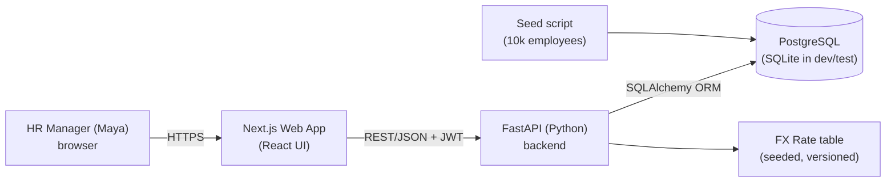
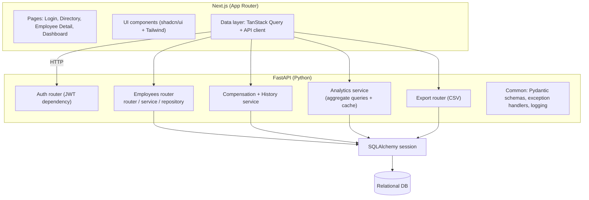
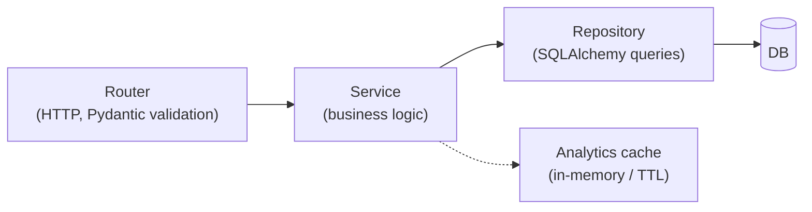
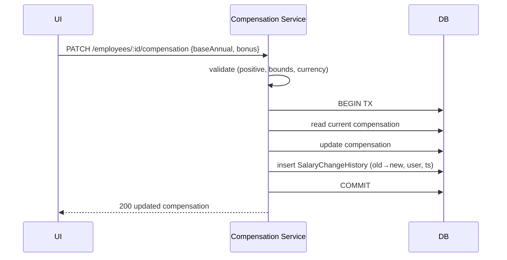
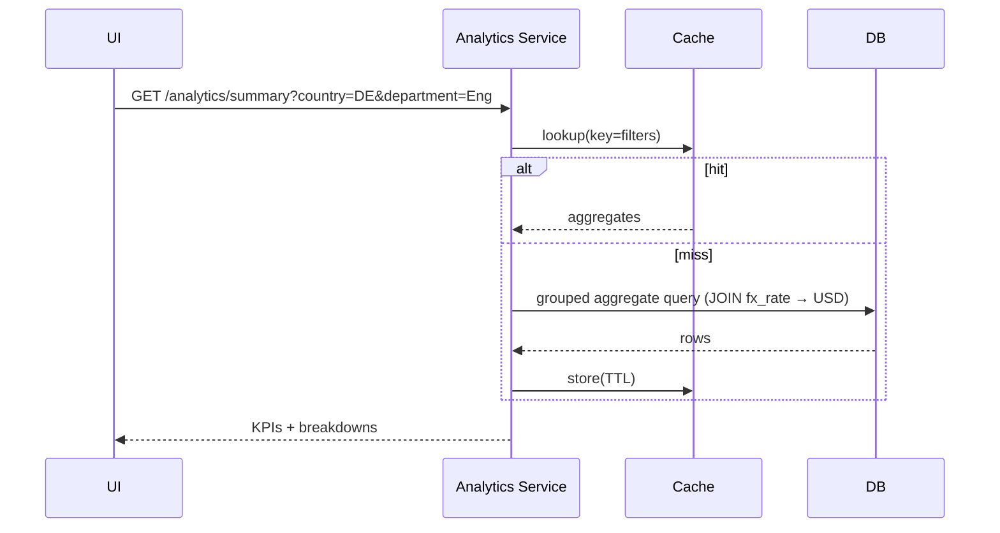
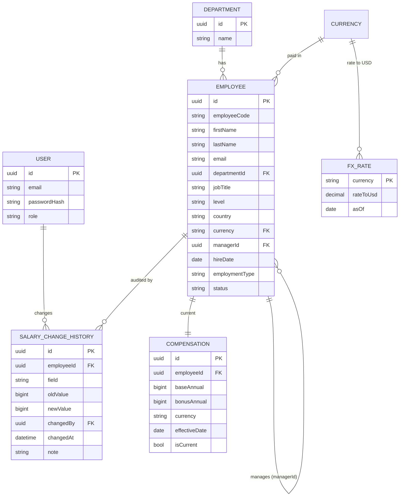

# Architecture

> Diagrams use Mermaid so they render in GitHub. Decisions are captured as ADRs at the
> bottom. Stack assumptions are in `questions.md` / `docs/REQUIREMENTS.md`.

## 1. System context (C4 — Level 1)

## 2. Container / component view (C4 — Level 2)

## 3. Layered backend design

- **Router**: request/response, input validation via Pydantic schemas, auth dependency.
- **Service**: business rules (validation bounds, currency normalization, history writes).
- **Repository**: data access, transactions, optimized aggregate SQL.
- Clear separation keeps logic testable (services unit-tested with mocked repos).

## 4. Key flows

### 4.1 Edit salary (with history + transaction)

### 4.2 Analytics query (normalized + cached)

## 5. Data model (ER)

## 6. Tech stack (decided — see questions.md)
| Layer | Choice | Why |
|-------|--------|-----|
| Frontend | **Next.js (App Router) + React + TypeScript** | Modern, fast, SSR-capable, great DX. |
| UI kit | **shadcn/ui + Tailwind** | Clean, accessible, fast to build a polished UI. |
| Data fetching | **TanStack Query (React Query)** | Caching, loading/error states, pagination ergonomics. |
| Backend | **FastAPI (Python 3.12)** | Fast, async, auto OpenAPI docs, Pydantic validation, clean DI. |
| Validation | **Pydantic v2** | Typed request/response schemas at the boundary. |
| ORM | **SQLAlchemy 2.0 + Alembic** | Mature, powerful queries + migrations; SQLite↔Postgres parity. |
| DB | **PostgreSQL** (prod) / **SQLite** (dev/test) | Brief allows SQLite; Postgres for prod realism. |
| Auth | **JWT** (python-jose) + **passlib/bcrypt** (single HR user seeded) | Lightweight, sufficient for v1. |
| Tests | **pytest** (+ httpx/TestClient API, Testing Library UI) | Fast, deterministic, standard. |
| Lint/format | **ruff + black** (BE), **ESLint + Prettier** (FE) | Industry-standard quality gates. |
| Packaging | **Docker + docker-compose** | One-command run; parity. |
| CI | **GitHub Actions** | Lint, typecheck, test on PR. |

## 7. Environments & deployment
- **Local:** `docker-compose up` → API + Postgres + web; or SQLite for zero-infra dev.
- **Test:** SQLite (in-memory/file) with fixed-seed fixtures for determinism.
- **Prod/demo:** Frontend → Vercel; API + Postgres → Render/Fly (documented). Confirm
  platform (questions.md Q13).

## 8. Cross-cutting concerns
- **Validation:** Pydantic schemas at the boundary; service-level invariants.
- **Errors:** consistent JSON error shape; global exception handlers.
- **Money:** stored as integer minor units (or integer base units) to avoid float error;
  currency always paired with amount.
- **Currency normalization:** join to `fx_rate` (versioned `asOf`) for USD aggregates.
- **Security:** auth guard on all data routes; no salary data on public endpoints;
  audit history on changes; secrets via env.
- **Observability:** structured request logging; basic health endpoint.

## 9. Architecture Decision Records (ADRs)
> Lightweight ADR format: Context → Decision → Consequences. Detail/alternatives in
> `docs/TRADEOFFS.md`.

- **ADR-001 — Python FastAPI backend + Next.js/React frontend.** Python backend per
  stakeholder direction; FastAPI gives async performance, auto OpenAPI docs, and
  Pydantic validation. *Consequence:* two languages (Python + TS); typed contract shared
  via OpenAPI rather than a single language.
- **ADR-002 — SQLAlchemy 2.0 + Alembic, relational DB with SQLite/Postgres parity.**
  Mature ORM + migrations, easy local dev on SQLite. *Consequence:* some advanced
  aggregates via SQLAlchemy Core / raw SQL.
- **ADR-003 — Server-side pagination/filtering/aggregation.** Required for 10k rows to
  stay fast. *Consequence:* more API surface vs. client-side filtering.
- **ADR-004 — Store amounts as integers + per-employee currency; normalize via FX
  table.** Avoids float errors, supports multi-country. *Consequence:* seeded (not live)
  FX rates.
- **ADR-005 — Immutable salary-change history.** HR trust/auditability. *Consequence:*
  extra writes per edit (acceptable).
- **ADR-006 — Deterministic analytics over LLM Q&A for core.** Correctness on sensitive
  data > novelty; NL Q&A is a stretch. *Consequence:* "questions" answered via
  dashboards/filters.
